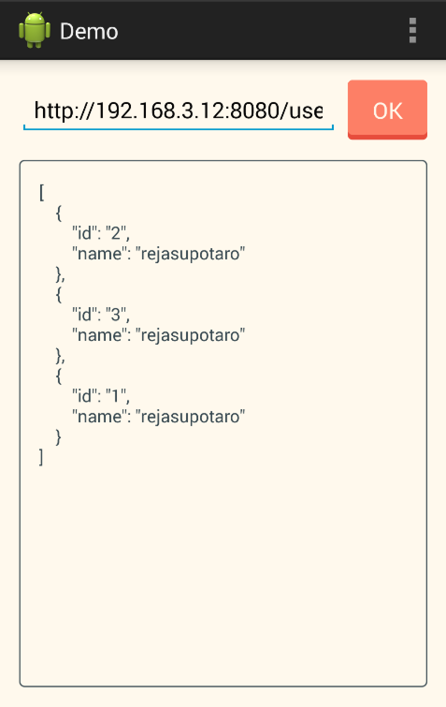

# API Orchestration Demo

This repository is demo of API Orchestration.

```
[Android App] <--> [RxNetty (API Orchestration)] <--> [Garage (RESTful API)]
```

### Android App

```java
public interface UserService {
    @GET("/users")
    Observable<List<User>> getUsers(@Query("ids") String ids);
    // -> /users?ids=1,2,3,...
}

userService.get("1,2,3")...
```

### RxNetty (API Orchestration)

```java
get("/users", (req, res) -> {
    HttpProxy proxy = new HttpProxy(req, res);
    String[] ids = getParamAsArray(req, "ids");

    String body = Observable.from(ids)
            .flatMap(s -> proxy.get(ENDPOINT + "/users/" + s)) // -> /users/1 /users/2 /users/3
            .flatMap(r -> r.getContent())
            .map(ResponseTransformer::toJson)
            .reduce(new JSONArray(), (t1, t2) -> {
                t1.put(t2);
                return t1;
            })
            .map(JSONArray::toString)
            .toBlocking().first();

    return close(res, body);
});
```

### Garage RESTful API

```ruby
class UsersController < ApplicationController
  include Garage::RestfulActions

  private

  # /users/:id
  def require_resource
    @resource = User.find(params[:id])
  end
```

## Start Servers

Run command `foreman start`, start orchestration server (RxNetty) on localhost:8080 and start RESTful API server (Garage) on localhost:3000.

## Install Android Demo App

```
$ cd android-client
$ ./gradlew assemble
$ adb install app/build/outputs/apk/app-debug.apk
```


